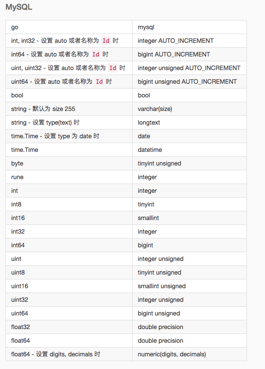

### Gorm
[gorm](https://github.com/jinzhu/gorm)的[操作文档](https://v1.gorm.io/zh_CN/docs/)。
#### gorm介绍:
1. 什么是orm？

`Object-Relationl Mapping`，即`对象关系映射`，这里的Relationl指的是关系型数据库

它的作用是在关系型数据库和对象之间作一个映射，这样，我们在具体的操作数据库的时候，就不需要再去和复杂的SQL语句打交道，只要像平时操作对象一样操作它就可以了.

映射关系：
结构体类型--> 数据表
结构体字段 --> 数据列表
结构体实例 --> 数据记录

2. gorm 特点
- 全功能ORM;
- 关联(包含一个，包含多个，属于，多对多，多种包含);
- Callbacks(创建/保存/更新/删除/查找之前/之后);
- 预加载;
- 事务
- 复合主键
- SQL Builder
- 自动迁移
- 日志
- 可扩展，编写基于GORM回调的插件
- 每个功能都有测试
- 开发人员友好
3. 安装
```go
go get -u github.com/jinzhu/gorm
```
4. 映射规则

- 结构体映射 数据表
  映射到数据库的结构体字段首字母必须大写
```go 

type User struct {
	ID       uint   `sql:"id"`
	UserName string `sql:"username"`
	Age      int    `sql:"age"`
	Gender   string `sql:"gender"`
}
```

|数据类型|  |
|   --  |   --  |
|int                 |int|
|int8                |tinyint|
|int16               |int|
|int32               |int|
|int64               |bigint|
|uint64              |bigint unsigned|
|float32/float64     |double|


结构体中标签说明：
|结构体标签|说明|
|   --  |   --  |
|column  |指定 db 列名|
|    type   |    列数据类型，推荐使用兼容性好的通用类型，例如：所有数据库都支持 bool、int、uint、float、string、time、bytes 并且可以和其他标签一起使用，例如：not null、size, autoIncrement… 像 varbinary(8) 这样指定数据库数据类型也是支持的。在使用指定数据库数据类型时，它需要是完整的数据库数据类型，如：MEDIUMINT UNSIGNED not NULL AUTO_INSTREMENT   |
|  size | 指定列大小，例如：size:256  |
|   primaryKey  |   指定列为主键    |
|   unique  |   指定列为唯一    |
|   default |   指定列的默认值  |
|   precision   |   指定列的精度    |
|   scale   |   指定列大小  |
|   not null    |   指定列为 NOT NULL   |
|   autoIncrement   |   指定列为自动增长    |
|   embedded    |       嵌套字段    |
|   embeddedPrefix  |   嵌入字段的列名前缀  |
|   autoCreateTime  |   创建时追踪当前时间，对于 int 字段，它会追踪时间戳秒数，您可以使用 nano/milli 来追踪纳秒、毫秒时间戳，例如：autoCreateTime:nano|
|   autoUpdateTime| 创建 / 更新时追踪当前时间，对于 int 字段，它会追踪时间戳秒数，您可以使用 nano/milli 来追踪纳秒、毫秒时间戳，例如：autoUpdateTime:milli|
|   index   |   根据参数创建索引，多个字段使用相同的名称则创建复合索引，查看 索引 获取详情|
|   uniqueIndex |   与 index 相同，但创建的是唯一索引|
|   check   |   创建检查约束，例如 check:age > 13，查看 约束 获取详情   |
|   <-  |   设置字段写入的权限， <-:create 只创建、<-:update 只更新、<-:false 无写入权限、<- 创建和更新权限 |
|   ->  |   设置字段读的权限，->:false 无读权限|    
|   -   |   忽略该字段，- 无读写权限    |

- 映射中的默认时间
>表名 ： 结构体名称的复数形式。
结构体名 UserName —> user_names
结构体名 UserNames —>user_names
可以通过 SingularTable(true) 禁用默认表名的复数形式
也可以通过DefaultTableNameHandler方法自定义表名生成的规则

>ID :字段默认为 主键

>gorm.Model ： GORM内置了一个gorm.Model结构体，包含了ID, CreatedAt, UpdatedAt, DeletedAt四个字段，可以将它嵌入到自己的模型中。

#### 连接数据库
GORM 官方支持的数据库类型有： MySQL, PostgreSQL, SQlite, SQL Server
+ mysql 数据库

```go
package main

import (
    "fmt"

    "github.com/jinzhu/gorm"
    _ "github.com/jinzhu/gorm/dialects/mysql"
)

type User struct {
    ID       uint   `sql:"id"`
    UserName string `sql:"username"`
    Age      int    `sql:"age"`
    Gender   string `sql:"gender"`
}

func main() {
    // 用户名:密码@tcp(ip:port)/数据库?charset=utf8mb4&parseTime=True&loc=Local
    dsn := "root:123456@tcp(127.0.0.1:3306)/db_test_grom?charset=utf8mb4&parseTime=True&loc=Local"
    db, err := gorm.Open("mysql", dsn)
    if err != nil {
        panic(err)
    } else {
        fmt.Println("数据库open done")
    }

    // 释放连接
    defer db.Close()

    db.SingularTable(true)
    db.LogMode(true) //启用logger

    tableUser := new(User)
    db.AutoMigrate(tableUser)
}


```
### [查询](https://v1.gorm.io/zh_CN/docs/query.html)
[Gorm查询](https://www.bookstack.cn/read/gorm-2.0/docs-query.md)文档。
```go
type User struct {
	ID       uint   `json:"id" sql:"id" gorm:"unique;autoIncrement"`
	UserName string `json:"username" sql:"username"`
	Age      int    `json:"age" sql:"age"  gorm:"default:18"` // 缺省 默认值18
	Gender   string `json:"gender" sql:"gender" gorm:"not null"`
}

```
+ 单个查询
>GORM 提供 `First`, `Take`, `Last` 方法，以便从数据库中检索单个对象。当查询数据库时它添加了 LIMIT 1 条件。当没有找到记录时，它会返回错误 `ErrRecordNotFound`

```go
// 获取第一条记录（主键升序）
db.First(&user)
// SELECT * FROM users ORDER BY id LIMIT 1;
// 获取一条记录，没有指定排序字段
db.Take(&user)
// SELECT * FROM users LIMIT 1;
// 获取最后一条记录（主键降序）
db.Last(&user)
// SELECT * FROM users ORDER BY id DESC LIMIT 1;
result := db.First(&user)
result.RowsAffected // 返回找到的记录数
result.Error        // returns error
// 检查 ErrRecordNotFound 错误
errors.Is(result.Error, gorm.ErrRecordNotFound)
```

+ 检索对象
```go
var users User
// 获取全部记录
result := db.Find(&users)
// SELECT * FROM users;
result.RowsAffected // 返回找到的记录数，相当于 `len(users)`
result.Error        // returns error
```

+ 条件检索
    - string 条件
    - struct & map 条件
    - 内联条件
    - Not条件
    - Or 条件
```go
var users User
// 获取第一条匹配的记录
db.Where("name = ?", "jinzhu").First(&user)
// SELECT * FROM users WHERE name = 'jinzhu' ORDER BY id LIMIT 1;
// 获取全部匹配的记录
db.Where("name <> ?", "jinzhu").Find(&users)
// SELECT * FROM users WHERE name <> 'jinzhu';
// IN
db.Where("name IN ?", []string{"jinzhu", "jinzhu 2"}).Find(&users)
// SELECT * FROM users WHERE name in ('jinzhu','jinzhu 2');
// LIKE
db.Where("name LIKE ?", "%jin%").Find(&users)
// SELECT * FROM users WHERE name LIKE '%jin%';
// AND
db.Where("name = ? AND age >= ?", "jinzhu", "22").Find(&users)
// SELECT * FROM users WHERE name = 'jinzhu' AND age >= 22;
// Time
db.Where("updated_at > ?", lastWeek).Find(&users)
// SELECT * FROM users WHERE updated_at > '2000-01-01 00:00:00';
// BETWEEN
db.Where("created_at BETWEEN ? AND ?", lastWeek, today).Find(&users)
// SELECT * FROM users WHERE created_at BETWEEN '2000-01-01 00:00:00' AND '2000-01-08 00:00:00';
```

```go
// struct
var users []User
db.Where(&User{UserName: "zhangsan"}).Find(&users)
for _, user := range users {
    fmt.Println(user)
}

//map
db.Where(map[string]interface{}{"age": 19}).Find(&users)
for _, user := range users {
    fmt.Println(user)
}
```

### [更新](https://v1.gorm.io/zh_CN/docs/update.html)
- 保存所有字段 save
```go
db.First(&user)
user.Name = "jinzhu 2"
user.Age = 100
db.Save(&user)
// UPDATE users SET name='jinzhu 2', age=100, birthday='2016-01-01', updated_at = '2013-11-17 21:34:10' WHERE id=111;
```
+ 使用 Update、Updates 可以更新选定的字段

```go
var u User
db.First(&u)
db.Model(&u).Updates(User{UserName: "litao", Age: 25, Gender: "男"})
```

### [删除](https://v1.gorm.io/zh_CN/docs/delete.html)
+ 删除记录
>警告 删除记录时，请确保主键字段有值，GORM 会通过主键去删除记录，如果主键为空，GORM 会删除该 model 的所有记录。
```go
db.Delete(&u)
```
+ 批量删除

>删除全部匹配的记录
```go
db.Where("age=?", 19).Delete(User{})

db.Where("email LIKE ?", "%jinzhu%").Delete(Email{})
//// DELETE from emails where email LIKE "%jinzhu%";

db.Delete(Email{}, "email LIKE ?", "%jinzhu%")
//// DELETE from emails where email LIKE "%jinzhu%";
```