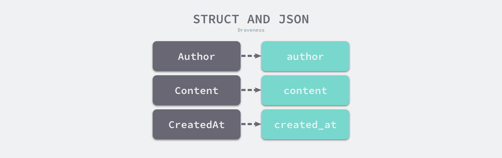

### 序列化
>把Go语言中结构体变量-->json 格式的字符串 


```GO
type Marshaler interface {
	MarshalJSON() ([]byte, error)
}

type Unmarshaler interface {
	UnmarshalJSON([]byte) error
}
```
[JSON](https://draveness.me/golang/docs/part4-advanced/ch09-stdlib/golang-json/)序列化的方法：使用 Marshal方法序列化。MarshalIndent()输出更加美观一些;MarshalIndent类似Marshal但会使用缩进将输出格式化。


```go
package main

import (
    "encoding/json"
    "fmt"
)

type person struct {
    Name string `json:"name"`
    Age  int    `json:"age`
}

func main() {
    p := person{
        Name: "wangsan",
        Age:  89,
    }
    //pJson, err := json.Marshal(p)
    pJson, err := json.MarshalIndent(p, "", "	")
    if err != nil {
        fmt.Println(err.Error())
        return
    }
    fmt.Printf("%v\n", string(pJson))
}
```
#### 标签
+ 省略空字段 omitempty
>JSON内的 `结构体` 字段增加 `omitempty` 关键字，初始化对象时未对该字段赋值，在序列化后将不显示；`结构体` 字段未注明忽略空值，序列化赋了默认0值：
```go
package main

import (
	"encoding/json"
	"fmt"
)

type person struct {
	Name    string `json:"name"`
	Country string `json:"country"`
	City    string `json:"city,omitempty"`
}

func main() {
	amy := person{
		Name: "Amy",
	}
	data, _ := json.MarshalIndent(amy, "", "    ")
	fmt.Println(string(data))
}
// {
//     "name": "Amy",
//     "country": ""
// }
```
+ 忽略字段“-”
```go
package main

import (
	"encoding/json"
	"fmt"
)

type person struct {
	Name    string `json:"name"`
	Country string `json:"-"`
	City    string `json:"city,omitempty"`
}

func main() {
	amy := person{
		Name:    "Amy",
		Country: "China",
	}
	data, _ := json.MarshalIndent(amy, "", "    ")
	fmt.Println(string(data))// 字符串本身就是由字节切片组成
}
// {
//     "name": "Amy"
// }
```
+ json中临时增加
```go
package main

import (
	"encoding/json"
	"fmt"
)

type person struct {
	Name    string `json:"name"`
	Country string `json:"country"`
	City    string `json:"city,omitempty"`
}

func main() {
	amy := person{
		Name:    "liliu",
		Country: "China",
		City:    "Beijing",
	}
	data, _ := json.MarshalIndent(struct {
		person
		Gender string `gender`
	}{
		person: amy,
		Gender: "女",
	}, "", "	")
	fmt.Println(string(data))

}
// {
//         "name": "liliu",
//         "country": "China",
//         "city": "Beijing",
//         "Gender": "女"
// }
```
### 反序列化
> 把json格式字符串 --> go语言能够识别的结构体变量

反序列化的方法：使用 UnMarshal方法序列化。
```go
package main

import (
    "encoding/json"
    "fmt"
)

type Person struct {
    Name string `json:"name"`
    Age  int    `json:"age"`
}

func main() {

    p1 := Person{"zhoulin", 70}
    p_json, err := json.Marshal(p1)

    if err != nil {
        fmt.Println("error", err.Error)
        return
    }
    fmt.Println(string(p_json))

    str := `{"name":"liwen","age":15}`
    var p2 Person
    json.Unmarshal([]byte(str), &p2) //c传指针为了在中内部修改p2
    fmt.Println(p2)
    fmt.Printf("%v\n", p2)
}
```