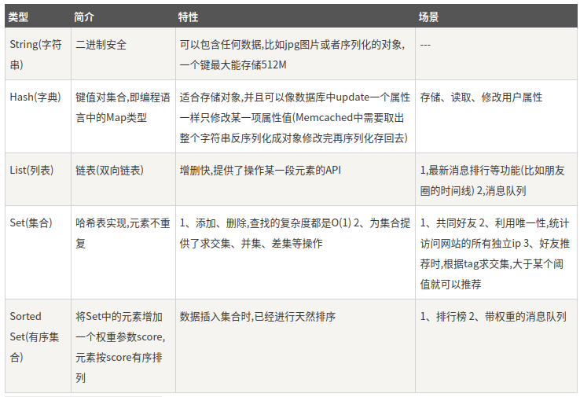

## Redis 数据类型

>Redis支持五种数据类型：string（字符串），hash（哈希），list（列表），set（集合）及zset(sorted set：有序集合)。
### String（字符串）

>string 是 redis 最基本的类型，你可以理解成与 Memcached 一模一样的类型，一个 key 对应一个 value。string 类型是二进制安全的。意思是 redis 的 string 可以包含任何数据。比如jpg图片或者序列化的对象。string 类型是 Redis 最基本的数据类型，string 类型的值最大能存储 512MB。
```
redis 127.0.0.1:6379> SET runoob "菜鸟教程"
OK
redis 127.0.0.1:6379> GET runoob
"菜鸟教程"
```
>在以上实例中我们使用了 Redis 的 SET 和 GET 命令。键为 runoob，对应的值为 菜鸟教程。注意：一个键最大能存储 512MB。

### Hash（哈希）

>Redis hash 是一个键值(key=>value)对集合。Redis hash 是一个 string 类型的 field 和 value 的映射表，hash 特别适合用于存储对象。每个 hash 可以存储 232 -1 键值对（40多亿）。
```
redis 127.0.0.1:6379> HMSET runoob field1 "Hello" field2 "World"
"OK"
redis 127.0.0.1:6379> HGET runoob field1
"Hello"
redis 127.0.0.1:6379> HGET runoob field2
"World"
```

实例中我们使用了 Redis HMSET, HGET 命令，HMSET 设置了两个 field=>value 对, HGET 获取对应 field 对应的 value。 

### List（列表）

>Redis 列表是简单的字符串列表，按照插入顺序排序。你可以添加一个元素到列表的头部（左边）或者尾部（右边）。列表最多可存储 232 - 1 元素 (4294967295, 每个列表可存储40多亿)。`lpush` `lrange`

```
redis 127.0.0.1:6379> DEL runoob
redis 127.0.0.1:6379> lpush runoob redis
(integer) 1
redis 127.0.0.1:6379> lpush runoob mongodb
(integer) 2
redis 127.0.0.1:6379> lpush runoob rabbitmq
(integer) 3
redis 127.0.0.1:6379> lrange runoob 0 10
1) "rabbitmq"
2) "mongodb"
3) "redis"
redis 127.0.0.1:6379>

```

### Set（集合）

>Redis 的 Set 是 string 类型的无序集合。集合是通过哈希表实现的，所以添加，删除，查找的复杂度都是 O(1)。`sadd` `smembers`

+ sadd 命令

添加一个 string 元素到 key 对应的 set 集合中，成功返回 1，如果元素已经在集合中返回 0。

### zset(sorted set：有序集合)
>Redis zset 和 set 一样也是string类型元素的集合,且不允许重复的成员。不同的是每个元素都会关联一个double类型的分数。redis正是通过分数来为集合中的成员进行从小到大的排序。zset的成员是唯一的,但分数(score)却可以重复。

+ zadd 命令

添加元素到集合，元素在集合中存在则更新对应score

