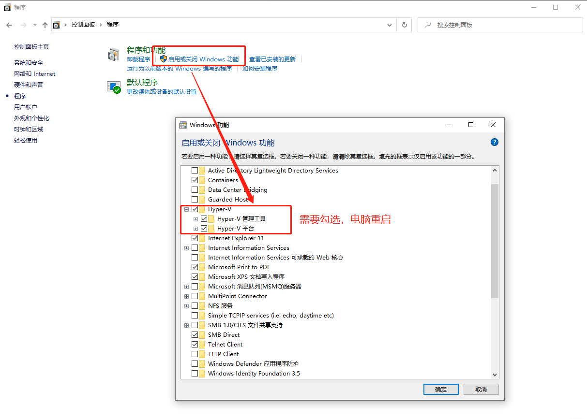
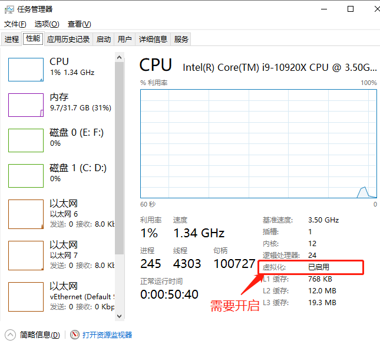
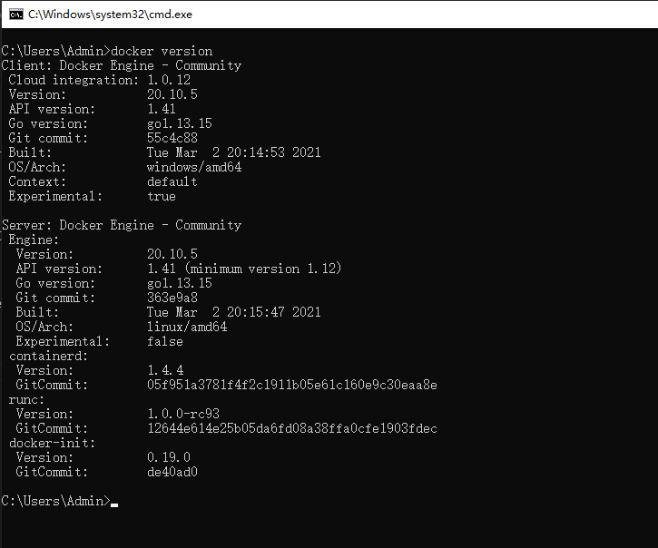
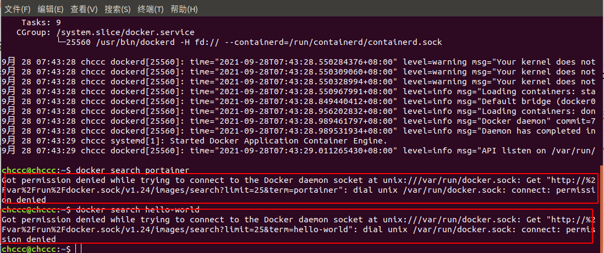
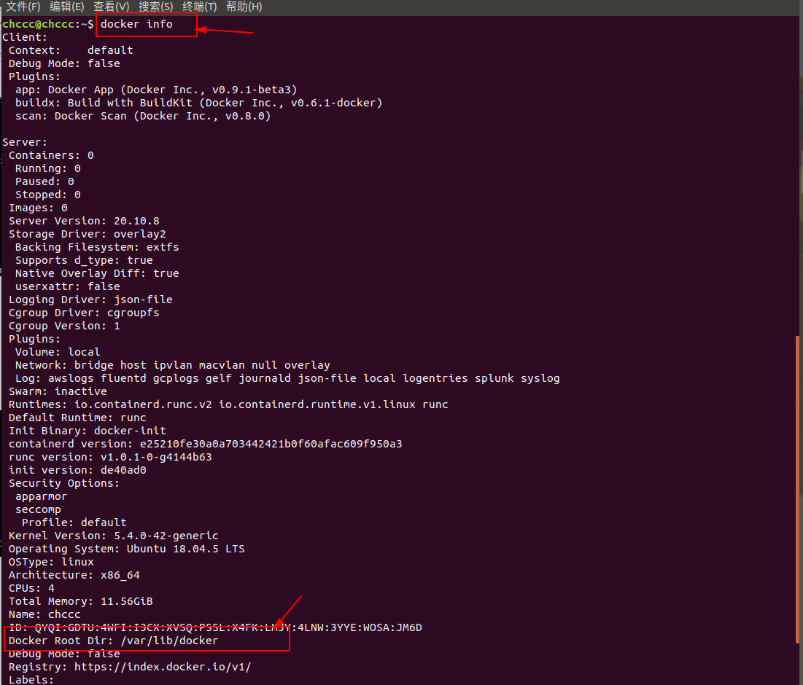
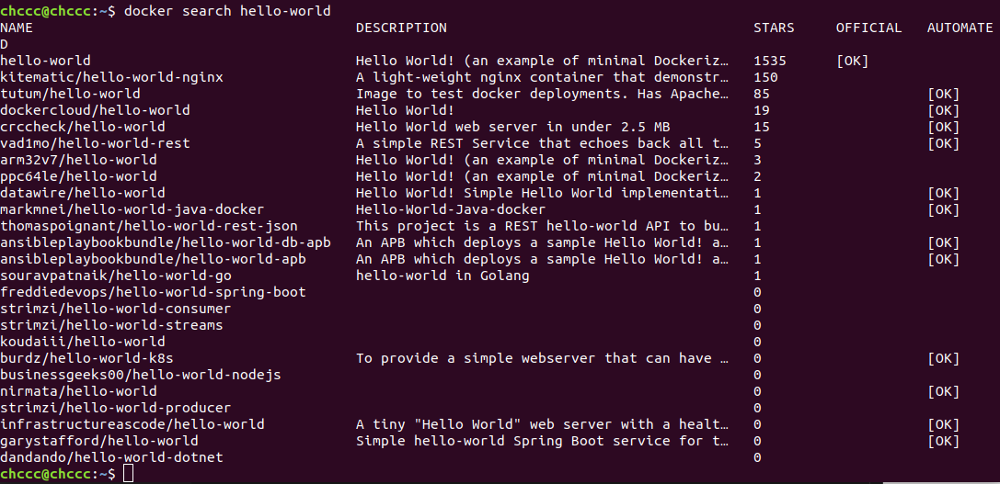

参考
[1. Docker网站](https://www.docker.com/)
[2. Docker博客](https://www.docker.com/blog/)
[3. Docker中文社区](https://www.docker.org.cn/)
[4. Docker — 从入门到实践](https://github.com/yeasy/docker_practice/blob/master/SUMMARY.md)

[6. Docker 入门教程](https://www.ruanyifeng.com/blog/2018/02/docker-tutorial.html)
[7. docker命令大全](https://www.runoob.com/docker/docker-command-manual.html)

#### win10 专业版安装Docker
1. 下载[桌面Docker](https://www.docker.com/products/docker-desktop)
   安装版本： 20.10.5
   只有一个：Docker Desktop图标
2. 如果系统是win10 X64专业版需要[下载WSL2](https://docs.microsoft.com/zh-cn/windows/wsl/install-win10#step-2---check-requirements-for-running-wsl-2) ，如果使用的是 ARM64 计算机，请[下载 ARM64 包](https://wslstorestorage.blob.core.windows.net/wslblob/wsl_update_arm64.msi)。 如果不确定自己计算机的类型，请打开命令提示符或 PowerShell，并输入：systeminfo | find "System Type"。 警告： 在非英语 Windows 版本中，你可能需要修改搜索文本，例如在德语中为 systeminfo | find "Systemtyp"。
3. 在控制面板里勾选Hyper-V


 对WSL2也启用虚拟化支持,使用管理员权限打开PowerShell，输入如下命令：
```
dism.exe /online /enable-feature /featurename:VirtualMachinePlatform /all /norestart
```


4. 打开 PowerShell，然后在安装新的 Linux 发行版时运行以下命令，将 WSL 2 设置为默认版本：
PowerShell。设置并安装WSL2
* 设置WSL2的环境,使用管理员权限打开PowerShell，输入如下命令：
```
dism.exe /online /enable-feature /featurename:Microsoft-Windows-Subsystem-Linux /all /norestart
```
* 安装WSL2

双击在2中下载的WSL2,一路默认，直到安装完成，也要重启电脑。


* [设置WSL2为默认版本](https://docs.microsoft.com/zh-cn/windows/wsl/install-win10#step-2---check-requirements-for-running-wsl-2)

使用管理员权限打开PowerShell，输入如下命令：
```
wsl --set-default-version 2
```
* Docker版本信息


* 测试Docker是否安装成功：
```docker
docker run hello-world
```
常用Docker语句：

```docker
# 查看当前docker版本
docker -v

# 查看当前本地所有镜像  
docker images

# 列出容器。 -a:所有容器包含没有运行的
docker ps 

# 查看当前运行下的镜像进程
docker ps -a

# 构造镜像,用法docker build -t 镜像名称 .
docker build -t docker_demo .

# 启动已被停止的容器【xx -> CONTAINER ID】
docker start xx
# 关闭已被启动的容器 
docker stop xx
# 重新启动容器
docker restart xx

# 杀掉一个运行中的容器
docker kill -s KILL xx

# 【 注：如果删除镜像，顺序：停止镜像里的容器，再删除容器，最后再删除镜像 】
# 删除一个或多少容器。-f :通过SIGKILL信号强制删除一个运行中的容器-l :移除容器间的网络连接，而非容器本身-v :-v 删除与容器关联的卷
docker rm -f xx、xx2
# 删除镜像
docker rmi xx

# 创建一个新的容器并运行，-d为后台执行，-p 9000:3000前面为主机端口，后面是容器端口。docker_demo镜像名
docker run -d -p 9000:3000 docker_demo

# 在运行的容器中执行命令。6576abc容器id
sudo docker exec -it 6576abc /bin/bash 

# 获取容器获取容器的日志 6576abc容器id，-t:显示时间戳
docker logs -f -t 6576abc

# 登陆镜像仓库
docker login

# 获取镜像
docker pull 
# 上传镜像
docker push
# 查看指定镜像的创建历史。
docker history docker_demo

# 进入容器
docker exec -t 6576abc /bin/bash

# 从宿主机拷文件到容器里面
docker cp /home/zhengqing/test.sql mysql_server:/tmp   # mysql_server：容器名  前：宿主机文件路径 后：容器路径

# 从容器里面拷文件到宿主机
docker cp 容器名:/tmp/test.sql /home  前：容器路径  后：宿主机路径

```

### ubuntu 使用Docker
#### ubuntu 安装Docker 
1. 更新软件源列表
```
sudo apt update
```
2. 安装软件依赖包
```
sudo apt install apt-transport-https ca-certificates curl software-properties-common
```
3. 在系统中添加Docker官方秘钥
```
curl -fsSL https://download.docker.com/linux/ubuntu/gpg | sudo apt-key add -
```
4. 安装稳定Docker源
```
sudo add-apt-repository "deb [arch=amd64] https://download.docker.com/linux/ubuntu bionic stable"
```
5. 更新软件源列表
```
sudo apt update
```

6. 重启docker 服务，查看服务状态
```
sudo systemctl restart docker
sudo systemctl status docker
```

7. ubuntu添加用户权限

`存在以下错误`
>Docker用户权限问题：Got permission denied while trying to connect to the Docker daemon socket at unix:///var/run/docker.


```
sudo groupadd docker     #添加docker用户组
sudo gpasswd -a $USER docker     #将登陆用户加入到docker用户组中
newgrp docker     #更新用户组
docker ps    #测试docker命令是否可以使用sudo正常使用
docker version # docker 版本信息
```
1. 查看Docker信息
```
docker info
```

9.  测试
```
docker search hello-world
```
