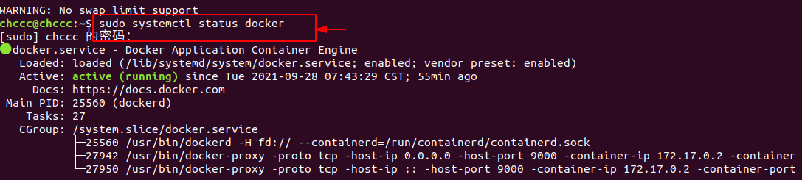

参考
[1. Docker网站](https://www.docker.com/)
[2. Docker博客](https://www.docker.com/blog/)
[3. Docker中文社区](https://www.docker.org.cn/)
[4. Docker — 从入门到实践](https://github.com/yeasy/docker_practice/blob/master/SUMMARY.md)

[6. Docker 入门教程](https://www.ruanyifeng.com/blog/2018/02/docker-tutorial.html)
[7. docker命令大全](https://www.runoob.com/docker/docker-command-manual.html)

#### win10 专业版安装Docker
1. 下载[桌面Docker](https://www.docker.com/products/docker-desktop)
   安装版本： 20.10.5
   只有一个：Docker Desktop图标
2. 如果系统是win10 X64专业版需要[下载WSL2](https://docs.microsoft.com/zh-cn/windows/wsl/install-win10#step-2---check-requirements-for-running-wsl-2) ，如果使用的是 ARM64 计算机，请[下载 ARM64 包](https://wslstorestorage.blob.core.windows.net/wslblob/wsl_update_arm64.msi)。 如果不确定自己计算机的类型，请打开命令提示符或 PowerShell，并输入：systeminfo | find "System Type"。 警告： 在非英语 Windows 版本中，你可能需要修改搜索文本，例如在德语中为 systeminfo | find "Systemtyp"。
3. 在控制面板里勾选Hyper-V


 对WSL2也启用虚拟化支持,使用管理员权限打开PowerShell，输入如下命令：
```
dism.exe /online /enable-feature /featurename:VirtualMachinePlatform /all /norestart
```


4. 打开 PowerShell，然后在安装新的 Linux 发行版时运行以下命令，将 WSL 2 设置为默认版本：
PowerShell。设置并安装WSL2
* 设置WSL2的环境,使用管理员权限打开PowerShell，输入如下命令：
```
dism.exe /online /enable-feature /featurename:Microsoft-Windows-Subsystem-Linux /all /norestart
```
* 安装WSL2

双击在2中下载的WSL2,一路默认，直到安装完成，也要重启电脑。


* [设置WSL2为默认版本](https://docs.microsoft.com/zh-cn/windows/wsl/install-win10#step-2---check-requirements-for-running-wsl-2)

使用管理员权限打开PowerShell，输入如下命令：
```
wsl --set-default-version 2
```
* Docker版本信息


* 测试Docker是否安装成功：
```docker
docker run hello-world
```
常用Docker语句：

```docker
# 查看当前docker版本
docker -v

# 查看当前本地所有镜像  
docker images

# 列出容器。 -a:所有容器包含没有运行的
docker ps 

# 查看当前运行下的镜像进程
docker ps -a

# 构造镜像,用法docker build -t 镜像名称 .
docker build -t docker_demo .

# 启动已被停止的容器【xx -> CONTAINER ID】
docker start xx
# 关闭已被启动的容器 
docker stop xx
# 重新启动容器
docker restart xx

# 杀掉一个运行中的容器
docker kill -s KILL xx

# 【 注：如果删除镜像，顺序：停止镜像里的容器，再删除容器，最后再删除镜像 】
# 删除一个或多少容器。-f :通过SIGKILL信号强制删除一个运行中的容器-l :移除容器间的网络连接，而非容器本身-v :-v 删除与容器关联的卷
docker rm -f xx、xx2
# 删除镜像
docker rmi xx

# 创建一个新的容器并运行，-d为后台执行，-p 9000:3000前面为主机端口，后面是容器端口。docker_demo镜像名
docker run -d -p 9000:3000 docker_demo

# 在运行的容器中执行命令。6576abc容器id
sudo docker exec -it 6576abc /bin/bash 

# 获取容器获取容器的日志 6576abc容器id，-t:显示时间戳
docker logs -f -t 6576abc

# 登陆镜像仓库
docker login

# 获取镜像
docker pull 
# 上传镜像
docker push
# 查看指定镜像的创建历史。
docker history docker_demo

# 进入容器
docker exec -t 6576abc /bin/bash

# 从宿主机拷文件到容器里面
docker cp /home/zhengqing/test.sql mysql_server:/tmp   # mysql_server：容器名  前：宿主机文件路径 后：容器路径

# 从容器里面拷文件到宿主机
docker cp 容器名:/tmp/test.sql /home  前：容器路径  后：宿主机路径

```
#### 命令含义

1. ps 列出容器
```txt
-a :显示所有的容器，包括未运行的。

-f :根据条件过滤显示的内容。

--format :指定返回值的模板文件。

-l :显示最近创建的容器。

-n :列出最近创建的n个容器。

--no-trunc :不截断输出。

-q :静默模式，只显示容器编号。

-s :显示总的文件大小。
```


### ubuntu 使用Docker
#### ubuntu 安装Docker 
1. 更新软件源列表
```
sudo apt update
```
2. 安装软件依赖包
```
sudo apt install apt-transport-https ca-certificates curl software-properties-common
```
3. 在系统中添加Docker官方秘钥
```
curl -fsSL https://download.docker.com/linux/ubuntu/gpg | sudo apt-key add -
```
4. 安装稳定Docker源
```
sudo add-apt-repository "deb [arch=amd64] https://download.docker.com/linux/ubuntu bionic stable"
```
5. 更新软件源列表
```
sudo apt update
```

6. 重启docker 服务，查看服务状态
```
sudo systemctl restart docker
sudo systemctl status docker
```

7. ubuntu添加用户权限

`存在以下错误`
>Docker用户权限问题：Got permission denied while trying to connect to the Docker daemon socket at unix:///var/run/docker.


```
sudo groupadd docker     #添加docker用户组
sudo gpasswd -a $USER docker     #将登陆用户加入到docker用户组中
newgrp docker     #更新用户组
docker ps    #测试docker命令是否可以使用sudo正常使用
docker version # docker 版本信息
```
1. 查看Docker信息
```
docker info
```

9.  测试
```
docker search hello-world
```


10.  Dockerfile文件
Dockerfile 文件是用于定义 **Docker 镜像生成流程的配置文件**，文件内容是一条条指令，每一条指令构建一层，因此每一条指令的内容，就是描述该层应当如何构建；这些指令应用于基础镜像并最终创建一个新的镜像。

     1. FROM
     指定基础的镜像，必须有指令，并且必须时第一条
     2. WORKDIR
     格式 WORKDIR<工作目录路径>
     使用WORKDIR来指定工作文件目录或者当前目录，以后各层的当前目录就改为指定目录，如果目录不存在，WORKDIR会帮你建立目录。
     3. COPY
     ```docker
     COPY <源路径>... <目标路径>
     COPY ["<源路径1>",... "<目标路径>"]
     ```
     COPY 指令将从构建上下文目录中 <源路径> 的文件/目录复制到新的一层的镜像内的 <目标路径> 位置
      4、RUN
      用于执行命令行命令

      格式：RUN <命令>
      5、EXPOSE
      格式为 EXPOSE <端口 1> [<端口 2>…]

      EXPOSE 指令是声明运行时容器提供服务端口，这只是一个声明，在运行时并不会因为这个声明应用就会开启这个端口的服务

      在 Dockerfile 中写入这样的声明有两个好处:a)帮助镜像使用者理解这个镜像服务的守护端口，以方便配置映射; b)运行时使用随机端口映射时，也就是 docker run -P 时，会自动随机映射 EXPOSE 的端口;
      ENTRYPOINT

      6.ENTRYPOINT 的格式和 RUN 指令格式一样，分为两种格式

      exec 格式：
      ```docker
      <ENTRYPOINT> "<CMD>"
      ```
      shell 格式：
      ```docker
      ENTRYPOINT [ "curl", "-s", "http://ip.cn" ]
      ```
      ENTRYPOINT 指令是指定容器启动程序及参数;
11. docker build构建镜像
```docker
docker build -t jwtdemo .
```
该命令作用是创建/构建镜像，**-t** 指定名称为 gin-blog-docker，**.** 构建内容为当前上下文目录;

12. docker 安装mysql 


```docker
# 搜索mysql 版本
docker search mysql

# 拉取mysql 
docker pull mysql:latest

# 查看本地
docker images
docker ps -a

# 启动mysql
docker run -itd --name mysql-test -p 3306:3306 -e MYSQL_ROOT_PASSWORD=rootrooot mysql

# 如果宿主机中没有安装MySQL客户端，需要先安装MySQL客户端
# 二选一，装一个就好
apt install mysql-client-core-5.7   
apt install mariadb-client-core-10.1
# 连接
mysql -u root -p rootroot

# 不出以外会报错
ERROR 2002 (HY000): Can't connect to local MySQL server through socket '/var/run/mysqld/mysqld.sock' (2)

# 宿主机启动mysql
mysql -h 127.0.0.1 -P 3306 -u root -p rootroot

# 查看mysql
show databases;
```
> -p 3306:3306 ：映射容器服务的 3306 端口到宿主机的 3306 端口，外部主机可以直接通过 宿主机ip:3306 访问到 MySQL 的服务。 MYSQL_ROOT_PASSWORD=123456：设置 MySQL 服务 root 用户的密码。

>在Docker中安装的MySQL和宿主机是两个概念，需要走tcp连接。所以原来的socket连接的命令就会报错。**必须用TCP连接命令与Docker中mysql 建立连接**


13. Dockerfile 文本文件

>Dockerfile 是一个用来构建镜像的文本文件，文本内容包含了一条条构建镜像所需的指令和说明。**Dockerfile**是一个包含用于组合映像的命令的文本文档。可以使用在命令行中调用任何命令。 Docker通过读取**Dockerfile**中的指令自动生成映像。docker build命令用于从Dockerfile构建映像。可以在**docker build**命令中使用 **-f** 标志指向文件系统中任何位置的Dockerfile。

+ 基本结构
Dockerfile 一般分为四部分：**基础镜像信息**、**维护者信息**、**镜像操作指令**和**容器启动时执行指令**，’#’ 为 Dockerfile 中的注释。Docker以从上到下的顺序运行Dockerfile的指令。为了指定基本映像，**第一条指令必须是FROM**。一个声明以＃字符开头则被视为注释。可以在Docker文件中使用RUN，CMD，FROM，EXPOSE，ENV等指令。

+ 指令
  [1. Dockerfile文件详解](https://www.cnblogs.com/panwenbin-logs/p/8007348.html)
  [2. Docker Dockerfile ](https://www.runoob.com/docker/docker-dockerfile.html)
  [3. Dockerfile reference](https://docs.docker.com/engine/reference/builder/)


  + FROM指令

   >  FROM 指定基础镜像，必须为第一个命令;

```docker
FROM <image>
FROM <image>:<tag>
FROM <image>@<digest>示例：　　FROM mysql:5.6注：　　tag或digest是可选的，如果不使用这两个值时，会使用latest版本的基础镜像

FROM scratch #
```

  + RUN指令
```docker
RUN用于在镜像容器中执行命令，其有以下两种命令执行方式：
shell执行
格式：
    RUN <command>
exec执行
格式：
    RUN ["executable", "param1", "param2"]
示例：
    RUN ["executable", "param1", "param2"]
    RUN apk update
    RUN ["/etc/execfile", "arg1", "arg1"]
注：　　RUN指令创建的中间镜像会被缓存，并会在下次构建中使用。如果不想使用这些缓存镜像，可以在构建时指定--no-cache参数，如：docker build --no-cache
```
  + CMD
>构建容器后调用，也就是在容器启动时才进行调用。

```docker
格式：
    CMD ["executable","param1","param2"] (执行可执行文件，优先)
    CMD ["param1","param2"] (设置了ENTRYPOINT，则直接调用ENTRYPOINT添加参数)
    CMD command param1 param2 (执行shell内部命令)
示例：
    CMD echo "This is a test." | wc -
    CMD ["/usr/bin/wc","--help"]注： 　　CMD不同于RUN，CMD用于指定在容器启动时所要执行的命令，而RUN用于指定镜像构建时所要执行的命令。
```
  + ENV指令
>设置环境变量

```docker
格式：
    ENV <key> <value>  #<key>之后的所有内容均会被视为其<value>的组成部分，因此，一次只能设置一个变量
    ENV <key>=<value> ...  #可以设置多个变量，每个变量为一个"<key>=<value>"的键值对，如果<key>中包含空格，可以使用\来进行转义，也可以通过""来进行标示；另外，反斜线也可以用于续行
示例：
    ENV myName John Doe
    ENV myDog Rex The Dog
    ENV myCat=fluffy
```
  + EXPOSE指令
>指定于外界交互的端口

```docker
格式：
    EXPOSE <port> [<port>...]
示例：
    EXPOSE 80 443
    EXPOSE 8080    EXPOSE 11211/tcp 11211/udp注：　　EXPOSE并不会让容器的端口访问到主机。要使其可访问，需要在docker run运行容器时通过-p来发布这些端口，或通过-P参数来发布EXPOSE导出的所有端口
```

  + WORKDIR
>工作目录，类似于cd命令

```docker
格式：
    WORKDIR /path/to/workdir
示例：
    WORKDIR /a  (这时工作目录为/a)
    WORKDIR b  (这时工作目录为/a/b)
    WORKDIR c  (这时工作目录为/a/b/c)注：　　通过WORKDIR设置工作目录后，Dockerfile中其后的命令RUN、CMD、ENTRYPOINT、ADD、COPY等命令都会在该目录下执行。在使用docker run运行容器时，可以通过-w参数覆盖构建时所设置的工作目录。
```
   + MAINTAINER
```docker
MAINTAINER vector4wang "xxxxxxx@qq.com"
```
   + ADD
  
   + COPY
  
   + ONBUILD
  
   + VOLUME
  


+ 实例jwtdemo
```docker
FROM scratch 
#scratch 官方说明：该镜像是一个空的镜像，可以用于构建busybox等超小镜像，可以说是真正的从零开始构建属于自己的镜像。

WORKDIR $GOPATH/src/jwtdemo
COPY . $GOPATH/src/jwtdemo

EXPOSE 8080
CMD ["./jwtdemo"]
```