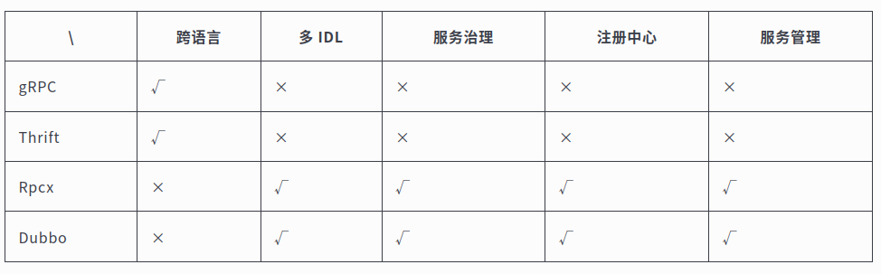

>RPC 代指远程过程调用（Remote Procedure Call），它的调用包含了传输协议和编码（对象序列号）协议等等。允许运行于一台计算机的程序调用另一台计算机的子程序，而开发人员无需额外地为这个交互作用编程。gRPC 是一个 基于 HTTP/2 协议设计的 RPC 框架，它采用了 Protobuf 作为 IDL.一个完整的 RPC 框架，应包含负载均衡、服务注册和发现、服务治理等功能，并具有可拓展性便于流量监控系统等接入，那么它才算完整的。


优点：简单、通用、安全、效率

### Protobuf
Protocol Buffers 是一种与语言、平台无关，可扩展的序列化结构化数据的方法，常用于通信协议，数据存储等等。相较于 JSON、XML，它更小、更快、更简单，因此也更受开发人员的青眯.
优点：
    更简单
    数据描述文件只需原来的 1/10 至 1/3
    解析速度是原来的 20 倍至 100 倍
    减少了二义性
    生成了更易使用的数据访问类


```go
//gRPC插件会为服务端和客户端生成不同的接口
func RegisterSearchServiceServer(s *grpc.Server, srv SearchServiceServer) {
	s.RegisterService(&_SearchService_serviceDesc, srv)
}

func NewSearchServiceClient(cc grpc.ClientConnInterface) SearchServiceClient {
	return &searchServiceClient{cc}
}
```
#### 为什么不用 Simple RPC

流式为什么要存在呢，是 Simple RPC 有什么问题吗？通过模拟业务场景，可得知在使用 Simple RPC 时，有如下问题：

+ 数据包过大造成的瞬时压力
+ 接收数据包时，需要所有数据包都接受成功且正确后，才能够回调响应，进行业务处理（无法客户端边发送，服务端边处理）

为什么用 Streaming RPC?

+ 大规模数据包
+ 实时场景
